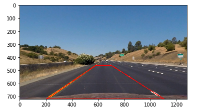

# Advanced Lane Finding Project

The goals / steps of this project are the following:

* Compute the camera calibration matrix and distortion coefficients given a set of chessboard images.
* Apply a distortion correction to raw images.
* Use color transforms, gradients, etc., to create a thresholded binary image.
* Apply a perspective transform to rectify binary image ("birds-eye view").
* Detect lane pixels and fit to find the lane boundary.
* Determine the curvature of the lane and vehicle position with respect to center.
* Warp the detected lane boundaries back onto the original image.
* Output visual display of the lane boundaries and numerical estimation of lane curvature and vehicle position.

---
## Camera Calibration

### 1. Briefly state how you computed the camera matrix and distortion coefficients. Provide an example of a distortion corrected calibration image.
First I created a list of object points like (0,0,0), (1,0,0), (2,0,0) ....,(6,5,0). This is the list of 3D coordinates of corners from top left to bottom right. For each chessboard image, I used Opencv's `findChessboardCorners` method to find corners in the image. If found, I stored the result in a list. Next, I used Opencv's `calibrateCamera` method and points found before to calculate the calibration matrix. The matrix will then be used in Opencv's `undistort` method to undistort a new image. Example below:


## Pipeline (single images)

### 1. Provide an example of a distortion-corrected image.
Here's an example undistorting a test image:


### 2. Describe how (and identify where in your code) you used color transforms, gradients or other methods to create a thresholded binary image. Provide an example of a binary image result.
I tried thresholding methods including absolute sobel, magnitude sobel, direction sobel and color threshold (HLS， RGB, LAB, and LUV). After many trials and I decided to use direction sobel, LAB for white lanes, and LUV for yellow lanes. The final parameters can be found in the combined cell of the notebook. Example image below:


### 3. Describe how (and identify where in your code) you performed a perspective transform and provide an example of a transformed image.
I first found a test image that contains straight lines. In order to find good source points I plotted a trapezoid as a helper. 




Since all images will be in the same size, I chose to manually determine the source and destination points as follows:

```
src = np.array([[585, 460], [205, 720], [1105, 720], [700, 460]]).astype(np.float32)
dst = np.array([[320, 0], [320, 720], [960, 720], [960, 0]]).astype(np.float32)
```

Then I calculated the transformation matrix and the inverse one for future usage. 

Then I tested the transformation on the test image:


### 4. Describe how (and identify where in your code) you identified lane-line pixels and fit their positions with a polynomial?

I followed the sliding window method in the course to find lane lines. The method first get the histogram to find the peak from a thresholded image. Then for each window, including one for left lane and one for right lane, find those thresholded pixels. Next fit a 2nd order polynomial to those pixels found. 

Here's an example of fitted polynomial:


### 5. Describe how (and identify where in your code) you calculated the radius of curvature of the lane and the position of the vehicle with respect to center.
For the curvature, first I calculated the scale factor from pixel to meter according to the U.S. standard. Then I refitted the line after rescaling pixels. Next I calculated the radius of curvature.

For the offset, we're calculating the difference between the midpoint of the lane lines detected and the midpoint of the frame. So first I calculated the midpoint of the lane lines with fitted polynomials. Then I calculate the difference in pixel and transform pixels into meters. 

### 6. Provide an example image of your result plotted back down onto the road such that the lane area is identified clearly.

Here's an example drawing the line onto the original color image and fill the area:


---

## Pipeline (video)

### 1. Provide a link to your final video output. Your pipeline should perform reasonably well on the entire project video (wobbly lines are ok but no catastrophic failures that would cause the car to drive off the road!).

The video is out.mp4 in the same directory:
[video](./out3.mp4)

## Discussion

### 1. Briefly discuss any problems / issues you faced in your implementation of this project. Where will your pipeline likely fail? What could you do to make it more robust?
The main issue and time I spent mostly on is the tweaking of those thresholds. First, the number of combinations of available color spaces, filters, parameters (max and min values) is huge. Second, the video frames from real world contains things like shadow, black tar on the road, and bright sunlight, etc. All of those can likely make the pipeline fail. To make it more robust, I used several methods:

1. tweaking the threshold a lot to accommodate changing environment as much as possible. E.g. I used both L channel in LUV space and B channel in LAB space to get clear yellow and white lines. The goal is to make the threshold less rely on sobel but more on color thresholding because sobel result may vary a lot depending on lighting condition
2. storing the last 3 reliable detected lines to calculate the average and using weighted average method to smooth the current fits
3. sanity check the current fits to make sure bad fits don't go through

My mentor gave me a paper about using neural net to detect lane lines. I think that could be a promising method to try out. 


